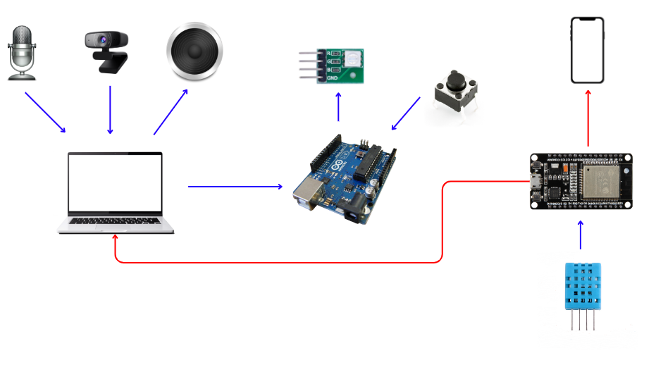
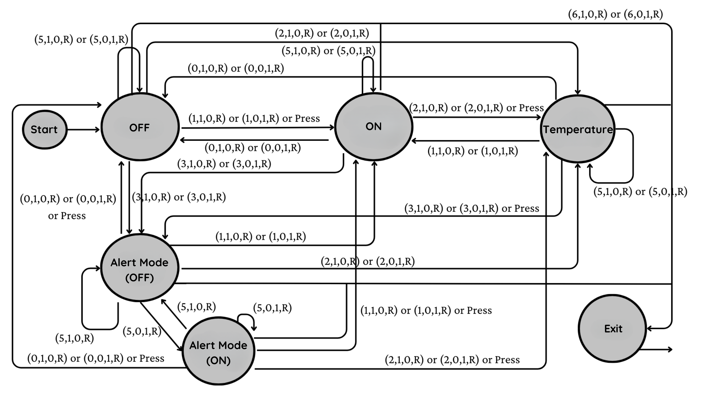
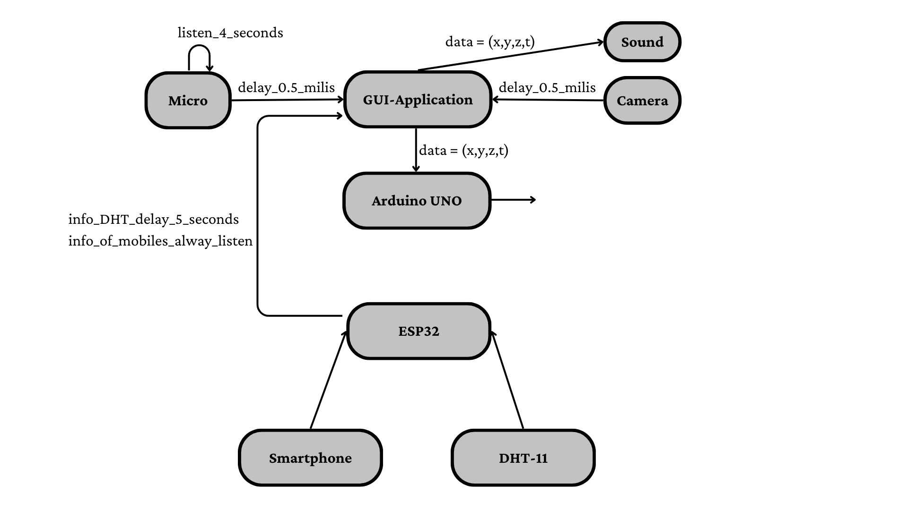

<!-- PROJECT LOGO -->
 
  

    <h1 style="text-align: center;">Multimodal AIoT System for LED Control</h1>
     
  

## Introduction
- The goal of this project is to develop a smart LED lighting control system to support daily living and security such as theft alert.

- Multi-options: ON/OFF, temperature-based color adjustment, theft alert functionality.

- Multi-interaction capabilities: mechanical buttons, voice, camera integration, and User Interface/GUI.

## Demo

## Technical

1. Programming language: Python, C++.

2. Library, framework: cvzone, open-cv, ultralytics (YOLOv8), speech_recognition, multiprocessing, socket, tkinker.

3. Devices: Arduino UNO, ESP32, DHT11, RGB Led, Camera, Microphone.
## Environment
1. Visual Studio Code
2. Arduino IDE

## Finite State Machine

 

